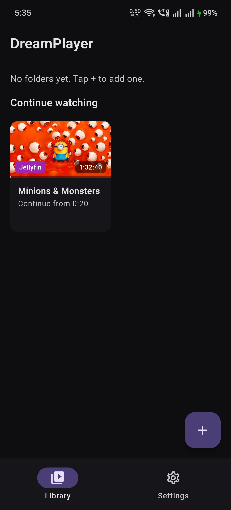
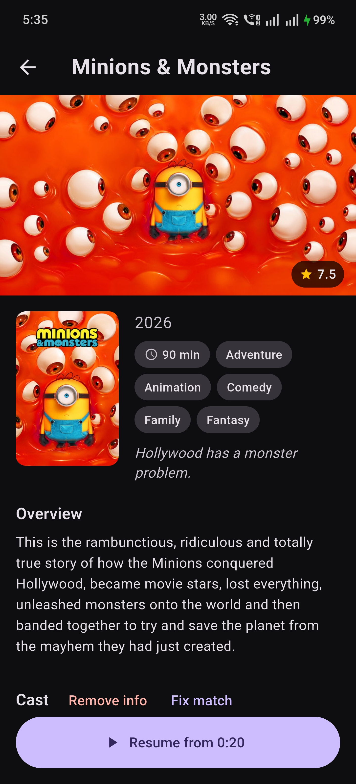
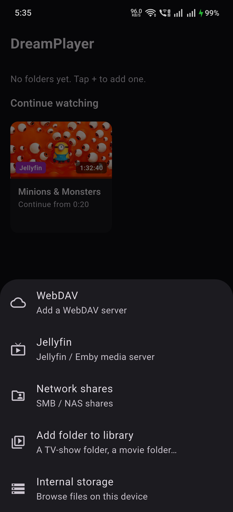
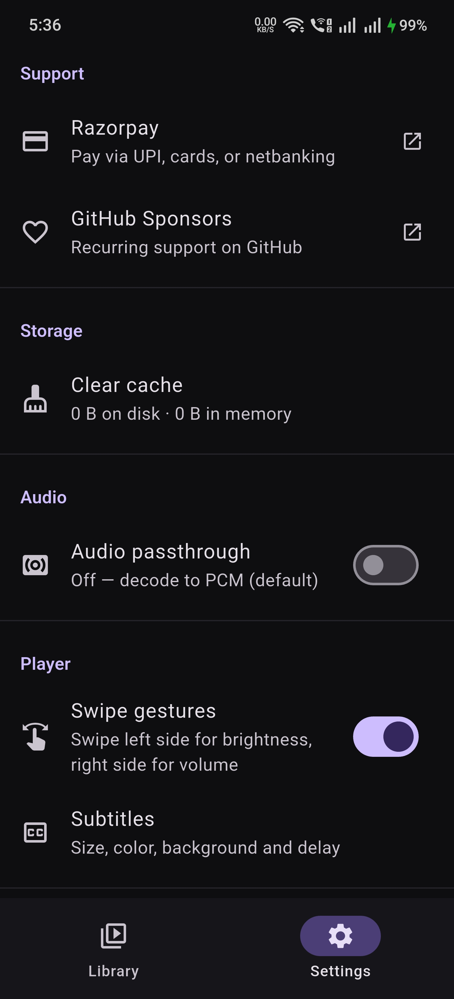

# DreamPlayer

<p align="center">
  
</p>

[](LICENSE)
[](https://github.com/mangeshghodke/DreamPlayer)
[](https://flutter.dev)
[](https://github.com/mangeshghodke/DreamPlayer/actions/workflows/ios.yml)
[](https://rzp.io/rzp/cZ5afqVG)
[](https://github.com/sponsors/mangeshghodke/)


A cross-platform video player for **Android, iOS/iPad, and Android TV** — built for true Dolby Vision, HDR10/HDR10+, and lossless audio playback.

> **This project is 100% vibe coded** — designed, directed, and tested by a human;
> written end-to-end in collaboration with AI coding agents, one feature at a time.
> Every feature ships only after real on-device verification.

## Highlights

### Dolby Vision & HDR
- Plays **Dolby Vision** Profile 8 at 4K 60fps with zero dropped frames
- Full **HDR10 / HDR10+ / HLG** passthrough to the display panel
- Live on-screen chips showing the active HDR format, video codec, audio codec, and resolution
- Graceful fallback on non-DV devices (plays as HDR10 or shows a clean error)

### Lossless Audio
- All major codecs: **DTS, DTS-HD, TrueHD, E-AC3, AC3, AAC, FLAC** and more
- Mid-playback **audio track switching** with full track names and channel info
- Optional **audio passthrough** over HDMI for Dolby Atmos / DTS:X on compatible soundbars
- **Spatial audio** (Android 13+) — teal chip shows when the system Spatializer virtualizes multichannel surround for your headphones/speakers; works with wired, USB, and Bluetooth output
- **Bass Boost** — Off/Low/Medium/High session-level DSP that restores the low-end HRTF virtualization thins out (appears while Spatial audio is engaged)
- **Volume Boost + Night Mode** — up to 3× loudness lift and dynamic-range compression (Android)

### Subtitles
- **Embedded + sideloaded** — every subtitle file next to the video auto-attaches
- Supports SRT, SSA/ASS, WebVTT, TTML, SAMI, MicroDVD, MPL2, SubViewer
- Full track picker with Off option; subtitles are anchored to the video, not the screen
- **Appearance settings** — size, color, background, outline, and sync delay with live preview (in the player's ⋮ menu)

### Network Playback
- **SMB / NAS** — in-app SMB browser on Android; CX Explorer "Open with" handoff
- **WebDAV** — browse and stream from WebDAV servers on both platforms
- **Jellyfin / Emby** — browse libraries, direct-play with auto-discovery
- **FTP / SFTP** — browse and stream from FTP servers and SSH/SFTP file hosts
- **DLNA / UPnP** — discover and play from media servers on your LAN
- **Files app "Open with"** on iPad with bookmarked folders
- Encrypted credentials (Android Keystore / iOS Keychain)

### Smart Library
- **Continue watching** — resume any partially-watched video with progress bars
- **User-added folders** — add a TV show or movie folder, get a TMDB poster and episode list
- **Jellyfin folders in the home library** — server shows sit alongside local folders
- **File browser** — browse device storage and play any video without importing

### Movie Metadata (TMDB)
- Every video opens a **details screen** with poster, backdrop, synopsis, rating, genres, runtime, and cast
- Metadata auto-fetches in the background — rows show poster thumbnails before you tap
- TV episodes labeled with Season/Episode info
- "Fix match" to correct a wrong auto-match

### Trakt Sync
- Connect your Trakt account from Settings to sync watch history

### Player Controls
- Play/pause, seek, ±10s, fullscreen, auto-hiding UI
- **Swipe gestures** — swipe left side for brightness, right side for system volume (phones/tablets, togglable in Settings)
- Aspect ratio picker: Fit, Crop, Stretch, 16:9, 4:3 (persists per video)
- **Chapters** — MKV chapter ticks in the overflow menu, current chapter highlighted, tap to seek
- **Playback speed** 0.25×–2× with refresh-rate matching on Android
- **Pinch-to-zoom**, horizontal-swipe seek, double-tap-to-seek ±10 s
- **Touch lock** — locks gestures during playback; tap once to reveal the unlock button
- **Watched marks** — videos auto-mark as watched at the end; toggle manually per row
- **Auto-play next episode** within the same folder (togglable)
- Resumes playback from where you left off, even after app close or screen lock

### Android TV / Fire TV
- Full 10-foot UI with D-pad navigation and custom focus highlights
- Leanback launcher banner
- Dolby Vision + HDR10 passthrough to the TV panel
- Audio passthrough for Atmos/DTS:X over HDMI
- Tested on Amazon Fire TV Stick 4K (Fire OS 7.1)

## Screenshots

<p align="center">
  
  &nbsp;&nbsp;
  
  &nbsp;&nbsp;
  
  &nbsp;&nbsp;
  
</p>

## Requirements

| Platform | Minimum version |
|---|---|
| Android | 5.0 (API 21) |
| iOS / iPadOS | 17.0 |

## Download

Prebuilt binaries are on the [Releases](https://github.com/mangeshghodke/DreamPlayer/releases) page.

- **Android** — universal APK + per-architecture APKs (arm64, armv7, x86_64)
- **iOS / iPadOS** — unsigned IPA; sideload with [SideStore](https://sidestore.io) or [AltStore](https://altstore.io)

### Installing on iPhone / iPad

1. Install [SideStore](https://sidestore.io) or [AltStore](https://altstore.io) on your device
2. Download `DreamPlayer-*.ipa` from the [latest release](https://github.com/mangeshghodke/DreamPlayer/releases)
3. Open SideStore/AltStore → **+** → select the IPA
4. The 7-day signature auto-refreshes over Wi-Fi

## Getting Started

```bash
flutter pub get
flutter run                    # run on a connected device
flutter test                   # run tests
flutter analyze                # static analysis
```

For TMDB metadata, copy `.env.example` to `.env` and add your API key:

```bash
flutter run --dart-define-from-file=.env
```

## License

Copyright (C) 2026 Mangesh Ghodke. Released under the [GNU General Public License v3.0](LICENSE).

## Support

If DreamPlayer is useful to you, consider supporting the project:

- [Razorpay](https://rzp.io/rzp/cZ5afqVG) — UPI, cards, or netbanking (India)
- [GitHub Sponsors](https://github.com/sponsors/mangeshghodke/) — recurring support

Both are also in the app under **Settings → Support**.
